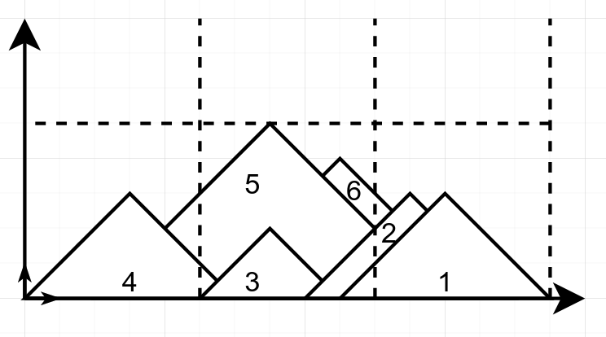

# Mountain landscape

### Context

You enter the Geneva area and you see the beautiful mountains for the first time. You argue with your friend about how much mountain you can see in the landscape.

### Problem

You are given a list of `N` mountains in a 2D landscape, represented as triangles.

The `N` mountains are defined by:
- The x position of their bottom-left corner (`left ∈ ℕ`)
- The x position of their bottom-right corner (`right ∈ ℕ, right > left`)
- Their height (`height ∈ ℕ`)
- Their base position is always 0 on y axis

The first element in the list `mountains[0]` represents the mountain which is the nearest from the observer (you). The last element `mountains[N-1]` represents the mountain behind all the others.

### Constraints

The constraints below are to be taken into account when implementing your solution. 

**Your solution will only be tested with inputs that satisfy all of the constraints below:**

- **For simplicity, the basis of any mountain is equal to two times its height:** `right - left = 2 * height`. This also implies that all mountains have the same slope (45°)
- There are `N ∈ [0, 1000]` mountains in total
- For each mountain:
  - `left, right, height ∈ ℕ`
  - `0 <= left < right < 10^5`
  - `1 <= height <= 5 * 10^4`

### Deliverable

a) Your job is to implement a function that takes a list of mountains as defined above and returns the visible area of mountains from the observer point of view:

```python
def visible_area(mountains: list) -> float
```

This function should be contained in a python file named `solution.py`

**Example**



The mountains list corresponding to the landscape above is defined like this:

```python3
mountains = [
    {'left': 9, 'right': 15, 'height': 3},
    {'left': 8, 'right': 14, 'height': 3},
    {'left': 5, 'right':  9, 'height': 2},
    {'left': 0, 'right':  6, 'height': 3},
    {'left': 2, 'right': 12, 'height': 5},
    {'left': 5, 'right': 13, 'height': 4},
]
```

Your function will be called like this:

```python3
area = visible_area(mountains)
```

**An input and output example:**

```python3
mountains = [
    {'left': 9, 'right': 15, 'height': 3},
    {'left': 8, 'right': 14, 'height': 3},
    {'left': 0, 'right':  6, 'height': 3},
]

# Testing:
area = visible_area(mountains)
print(area) # Should print 20.75 (area corresponding to the mountains given in the last example)
```

b) The second part of the job is to cover your solution with some unit tests.<br>
The tests should be written in a separate file called `test.py`.

### Ranking

Your code will be evaluated on the following points (from most important to least important):
- Correctness of the program
- Performance efficiency
- Clarity and architecture of the code
- Code style (PEP8)

You are not allowed to use libraries other than libraries from the Python Standard Library and your code should be compatible with python3.11
